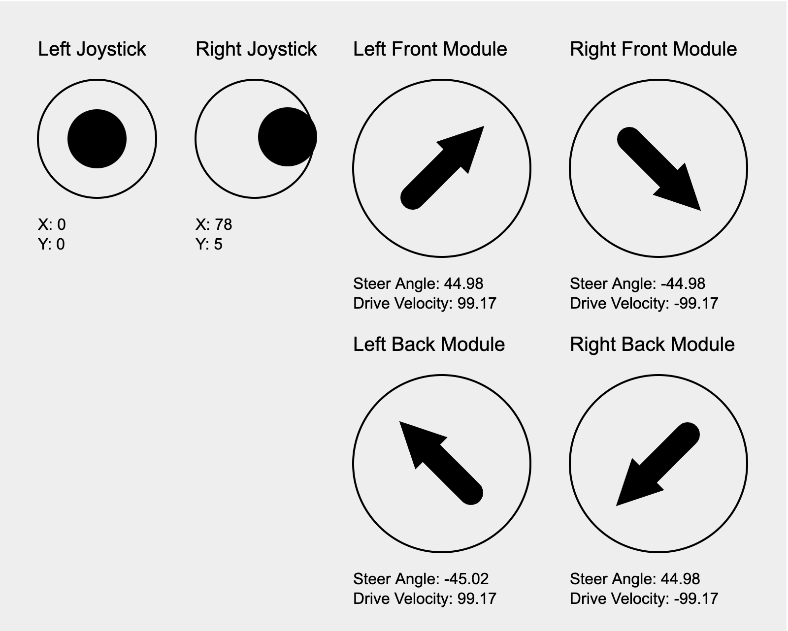

# IQ Swerve Bot Visualizer

[](https://swerve-bot-demo.jerryio.com)

An interactive web-based visualization tool for understanding swerve drive kinematics and control systems. Designed specifically for VEX IQ/V5 teams, this simulator demonstrates advanced holonomic movement capabilities through real-time physics simulation and vector visualization.



## Features

- **Real-time vector visualization** of wheel direction and velocity
- **Dynamic module states** showing steering angles and drive speeds
- **Field-centric control** simulation with dual joystick input
- **Physics-based motor models** with inertia and voltage simulation
- **Optimal path calculation** for wheel rotation (≤90° turns)
- **4-module configuration** with positional awareness

## Live Demo

Experience the visualizer directly:  
[https://swerve-bot-demo.jerryio.com](https://swerve-bot-demo.jerryio.com)

## Swerve Drive Mechanics

### Coordinate System Definition

- **Y Axis**: Increases north (forward direction)
- **X Axis**: Increases east (right direction)
- **Heading**: 0° at north (Y+), increasing clockwise (0°-360°)

### Kinematic Model

Swerve drive enables true holonomic movement through independent control of each wheel's:

1. **Steering Angle** - Wheel direction relative to robot center
2. **Drive Velocity** - Wheel speed magnitude

The kinematic system combines translation and rotation vectors using:

```math
\begin{bmatrix}
V_{moduleX} \\
V_{moduleY}
\end{bmatrix} =
\begin{bmatrix}
V_{transX} \\
V_{transY}
\end{bmatrix} +
\omega_{norm} \cdot r \cdot
\begin{bmatrix}
\sin(\theta + \alpha) \\
\cos(\theta + \alpha)
\end{bmatrix}
```

Where:

- $\omega_{norm} \in [-1,1]$: Normalized rotation input
- $r$: Module distance from center
- $\theta$: Module angular offset
- $\alpha$: Current robot heading

### Optimal Wheel Rotation Mathematics

<!-- The `shortestTurn` algorithm ensures minimal angular movement through intelligent direction reversal. -->

The swerve drive module will always turn the shortest path to the target heading. For example, if the module is facing 0 degrees and the target heading is 135 degrees, it will turn left 45 degrees to get to 45 degrees, then reverse the wheel direction, ensuring minimal movement. Given:

- Current encoder position: $p_c \in \mathbb{R}$ (unbounded degrees)
- Current movement direction: $`d_c \in \{-1, 1\}`$
- Target heading: $h_t \in [0, 360)$

The algorithm computes:

**Effective Current Heading**:

$$ h_c = (p_c + 90 \cdot (1 - d_c)) \mod 360 $$

Where $`d_c \in \{-1,1\}`$ simplifies direction handling:

- $`d_c = 1$: $h_c = p_c \mod 360`$
- $`d_c = -1$: $h_c = (p_c + 180) \mod 360`$

**Angular Delta Calculation** using modular arithmetic:

$$ \Delta = ((h_t - h_c + 180) \mod 360) - 180 $$

This normalizes the difference to $[-180, 180)$ range

**Direction Optimization**:

$$
\text{If } |\Delta| > 90: \begin{cases}
  p_t = p_c + (\Delta - 180 \cdot \text{sign}(\Delta)) \\
  d_t = -d_c
\end{cases}
$$
$$
\text{Else}: \begin{cases}
  p_t = p_c + \Delta \\
  d_t = d_c
\end{cases}
$$

This piecewise function guarantees the wheel always rotates ≤90° to reach target orientation, minimizing mechanical wear and energy consumption.

### Wheel Velocity Calculation

The drive velocity is determined by the magnitude of the combined translation and rotation vectors:

$$ v = \text{clamp}\left(\sqrt{x^2 + y^2 + \omega^2},\ 0,\ 1\right) \times v\_{\text{max}} \times d $$

Where:

- $x, y$: Normalized translation inputs $[-1, 1]$
- $\omega$: Normalized rotation input $[-1, 1]$
- $v_{\text{max}}$: Maximum motor velocity (140 RPM)
- $d \in \{-1, 1\}$: Direction from the previous step

## System Architecture

The architecture of the IQ Swerve Bot Visualizer is structured into three distinct layers, each responsible for different aspects of the application's functionality. This separation ensures modularity and ...

### Presentation Layer (src/routes/+page.svelte)

This layer is primarily concerned with user interaction and the visual representation of the swerve drive system. It handles input from the user through virtual joysticks and displays the state of the swerve modules in real-time. The layer initializes the simulation context and starts the physics engine, providing a dynamic and interactive visual experience.

Responsibilities:

- Rendering the user interface and visual elements.
- Capturing and processing user inputs via joysticks.
- Displaying real-time feedback on the swerve modules' states.

### Control Layer (src/lib/Usercode.ts)

The control layer is where the logic for swerve drive kinematics is implemented. It operates on a 10ms interval, processing inputs from the physical controllers and computing the necessary adjustments to the swerve modules' positions and velocities based on the user's input. This layer uses the context to interact with the hardware simulation, sending commands and receiving feedback.
Responsibilities:

- Implementing the swerve drive kinematics and control algorithms.
- Processing encoder readings from the motors to adjust positions.
- Calculating and setting velocities for the motors based on joystick inputs.

### Physics Layer (src/lib/Hardware.svelte.ts)

At the core of the simulation is the physics layer, which simulates the physical behavior of motors and other components. This layer includes detailed implementations of motor dynamics, such as velocity and position PID controllers, and handles the physical constraints and behaviors of the motors based on the commands received from the control layer.
Responsibilities:

- Simulating motor dynamics and physical behaviors.
- Implementing PID controllers for precise control over motor velocity and position.
- Managing the simulation state and updating the system at a 10ms interval.

### Interaction Between Layers

- **User Code and Physics Simulation**: The control layer interacts with the physics layer through a well-defined interface provided by the context. This interface is similar to the VEX IQ SDK, but simplified for the purpose of this simulation. This allows the control layer to command motor movements without direct access to the underlying motor implementations.

- **Physics Layer and Presentation**: The physics layer updates the presentation layer with the latest state of the motors, which is then rendered on the screen. This separation ensures that the UI can remain responsive and focused on display logic, while the physics layer focuses on simulation accuracy.

## Development Setup

```bash
# Install dependencies
bun install

# Start development server
bun run dev

# Build production version
bun run build
```

## Reference Materials

- [Swerve Drive Fundamentals - Team 6624](https://compendium.readthedocs.io/en/latest/tasks/drivetrains/swerve.html)
- [VEX IQ Swerve Implementation - 6083程式組](https://hackmd.io/@6083overlookingPrograming/B1psNHAqR)
- [Motor Dynamics Model](https://ctms.engin.umich.edu/CTMS/index.php?example=MotorSpeed&section=SystemModeling)
- [Field-Centric Mathematics](https://www.chiefdelphi.com/t/field-centric-swerve-drive/163560)
